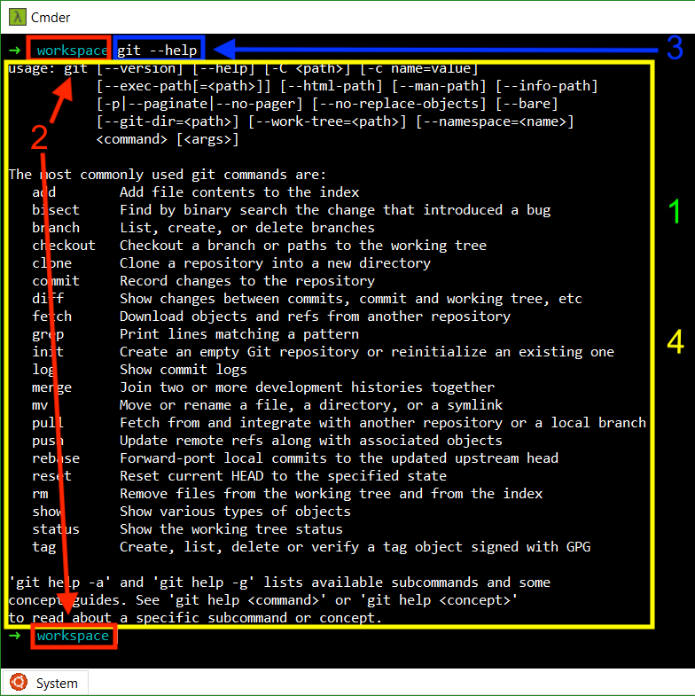
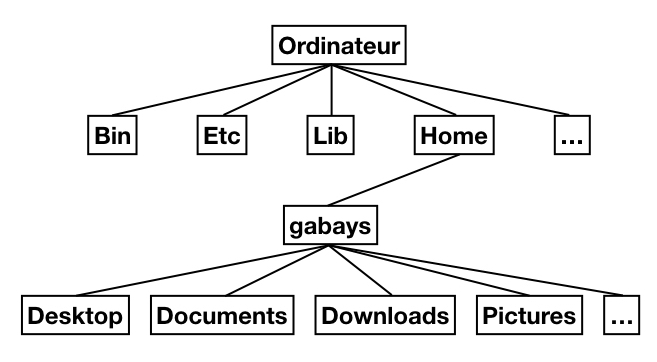

Distant Reading I: hacker les humanités

# Les lignes de commandes et Bash

Simon Gabay
Genève

---

Des machines virtuelles avec linux sont disponibles à l'adresse suivante:

https://vdi.unige.ch

Le cours se déroulera sur ces machines, qui utilisent LINUX.

---
# Le chemin

---

## Interface en ligne de commande

Une interface en ligne de commande (_command line interface_, couramment abrégé CLI) est une interface homme-machine dans laquelle la communication entre l'utilisateur et l'ordinateur s'effectue en mode texte:

* l'utilisateur tape une ligne de commande, c'est-à-dire du texte au clavier pour demander à l'ordinateur d'effectuer une opération ;
* l'ordinateur affiche du texte correspondant au résultat de l'exécution des commandes tapées ou à des questions qu'un logiciel pose à l'utilisateur.

---



1. Terminal
2. Invite de commande
3. Requête
4. Réponse

---
## _Filesystem Hierarchy Standard_

La "norme de la hiérarchie des systèmes de fichiers" (HFS) définit l'arborescence et le contenu des principaux répertoires des systèmes de fichiers des systèmes d'exploitation GNU/Linux et de la plupart des systèmes Unix.



---
## Quelques répertoires

* `/bin/`: Commandes de base nécessaires au démarrage et à l'utilisation d'un système minimaliste
* `/etc/`: Fichiers de configuration
* `/lib/`: Bibliothèques (_libraries_) logicielles nécessaires pour les exécutables
* `/home/`: Répertoires des utilisateurs
* …

Les répertoires de chaque utilisateurs sont eux connus:
* `Desktop` pour le bureau
* `Documents` pour les documents
* `Downloads` pour les téléchargements
* …

---
## `root`

Les répertoires sont organisés comme un arbre:


Le premier répertoire (ici `ordinateur`) est appelé le répertoire _racine_ (`root`): il contient tous les autres, organisés comme des branches partant de ce tronc.

---
## Chemin

L'adresse du répertoire racine est `/`. Celle d'un répertoire ou d'un fichier précis est ainsi la liste des répertoires depuis `root` pour accéder à celui voulu, chaque nom étant séparé avec un `/`. Ainsi, pour atteindre le fichier `bash` dans le dossier `bin`, je suis le _chemin_ suivant:

```console
/bin/bash
```


---
## Chemin relatif

Le chemin que nous venons de voir est dit _absolu_, car il part de l'élément racine, mais il existe aussi des chemins relatifs si je pars d'un autre endroit (normalement celui où je suis déjà).

```console
gabays/home/bin/bash
```


---
## Chemin relatif II

Parfois il est impossible de savoir quel est le nom du fichier précédent dans l'arborescence, il est possible d'utiliser un raccourci: `..` signifie ainsi "remonter d'un fichier"

```console
gabays/home/bin/bash
```

est ainsi l'équivalent de

```console
gabays/../bin/bash
```

---
## Conventions de nommage

1. Il est fortement déconseillé d'utiliser des espaces
2. Des stratégies alternatives existent comme:
	2.1 Le camelCase (par exemple: `nomDeFichier.extension`)
	2.2 Avoir recours à des tirets (`nom-de-Fichier.extension`) ou des tirets bas (`nom_de_Fichier.extension`)
	2.3 Tentez d'être cohérent dans cette stratégie
3. Versionnez les documents (`nom-de-Fichier-v1.extension`) ou datez-les en commençant par l'année (`nom-de-Fichier-AAA-MM-JJ.extension`)
4. L'extension doit être choisie avec attention: un `.txt` n'est pas un `.xml`

---

# Utiliser les lignes de commandes

---
## Shell, kernel…

Le _shell_ est une interface système permettant d'accéder au cœur (_kernel_) et d'interagir avec l'OS (_operating system_). Il permet d'envoyer des instructions.

Ces instructions doivent être dans un format précis, compréhensible par la machine. Nous avons donc besoin d'un langage de programmation: il s'agit d'un _shell Unix_, qui est un interpréteur de commandes.

Il existe de nombreux _shell Unix_, et le plus connu est le _Bash_ (_Bourne-Again shell_). C'est un interpréteur en ligne de commande de type script. On l'utilise depuis le terminal/la console, contrairement aux applications utilisant une GUI (_graphical user interface_).

---


---
## Première commande

Ouvrez le terminal, et tapez `pwd`: que se passe-t-il?

---
## Fonctionnement

* Bash exécute les instructions ligne par ligne: la fin de ligne est la fin de commande.
* Une commande doit être complète, sinon l'invite `>` s'affiche.
* Une commande est appelée par son nom (par exemple `pwd`), qui permet de retrouver la fonction, le _builtin_, le programme associé
  * Une fonction est un bloc de commandes qui s'exécute lorsque la fonction est appelée
  * Un _builtin_ ("préconstruit", comprendre "prédéfini") est une mini-opération pré-construite en bash
  * Un programme est un groupe d'instructions

---
## Localisation

Certaines commandes prédéfinies sont enregristrées dans la machine (comme `pwd` ou `ls`): leur nom suffit pour les appeler.

```bash
pwd
```

```bash
ls
```

Dans d'autres cas, comme celui de scripts ou de programmes, il faut spécifier le chemin ou le fichier se trouve. Pour cela on utilise le chemin absolu ou (ici) relatif:

```bash
commandes/commande_1.sh
```

* Devinez le contenu du fichier
* Retrouvez le fichier `commande_1.sh`

---
## Argument

Certaines commandes vont nécessiter des précisions: copier _ceci_, aller _là-bas_. Pour donner ces précisions, on va ajouter à la commande des arguments.

Prenons l'exemple de la commande `cd` (_change directory_) qui permet de se déplacer. On pourrait la traduire par `"aller à" [commande] + lieu [argument]`. Le lieu où l'on se dirige prend la forme du répertoire-destination placé juste après la commande:

```bash
cd commandes
```
---
## Exercice

* Naviguez jusqu'au répertoire `document`
* exécutez la commande suivante:

```bash
git clone https://github.com/gabays/DistRead_1.git
```

* Tentez de comprendre ce qu'il s'est passé
* Placez-vous dans le répertoire que vous venez de télécharger

---
## Arguments

Parfois on peut avoir besoin de plusieurs arguments. On les ajoute ainsi les uns après les autres.

Par exemple la commande `cp` (_copy_), que l'on peut traduire par `"copier" [commande] + tel chose [argument 1] + à tel endroit  [argument 2]`.

```bash
cp commandes/commande_1.sh .
```

---
## Options

On peut ajouter des options, qui vont modifier le comportement normal de la commandes. Elles sont placées après la commande et son précédées d'un tiret (`-`).

Par exemple la commande `rm` (_remove_) qui permet d'effacer un fichier. Tentez de supprimer le fichier `commande_1.sh` que vous venez de créer:

```bash
rm commande_1.sh
```

(répondez `n` et tapez entrée)

l'option `-f` permet de forcer la commande:

```bash
rm -f commande_1.sh
```

---
# Commandes de base

---

## Lecture

Vous pouvez regarder ce que contient un fichier avec la commande `less`

```bash
less commandes/commande_1.sh
```

(pour quitter tapez `:q`)

Il existe de multiples éditeurs pour le terminal, accessible en tapant leur nom puis le nom du fichier:

* `nano` (pour quitter `ctrl+X`)
* `vim` (pour quitter tapez `:q`)

Vous pouvez examiner le type du fichier avec la commande `file`

```bash
file commandes/commande_1.sh
```

---
## Aide

La commande `man` (avec en argument le nom de la commande) permet d'afficher le manuel de la commande:

```bash
man ls
```

La commande `compgen -c` permet d'afficher toutes les commandes disponibles (`compgen -a` tous les alias).

```bash
compgen -c
```

---
## Créer un script

La commande `touch` permet de créer un fichier:

```bash
touch test.sh
```

Tentons de créer notre premier script bash avec la commande `nano`. Petite astuce: on déclare normalement le type de document avec un appel de script (ou _Shebang_) indiquant que le fichier n'est pas un fichier binaire mais un script:

```bash
#!/bin/bash
ls
```

---
## Exécution du script

Ce script permet d'exécuter la commande `ls`. Il est exécuté de la manière suivante:


```bash
./test.sh
```

ou

```bash
bash test.sh
```
---
## Déplacer le script

La commande `mkdir` (_make directory_) permet de créer un répertoire:

```bash
mkdir test
```

La commande `cp` (_copy_) permet de copier un fichier:

```bash
cp test.sh test
```

Il est possible de déplacer une multitude de fichier en les mettant à la suite:

```bash
cp SOURCE_1 SOURCE_2 SOURCE_3 TARGET
```

Il est possible de copier un fichier dans le même répertoire en lui attribuant un nouveau nom:


```bash
cp test/test.sh test/test_copy.sh
```

---
## Déplacer le script (2)

Un alternative à la commande `cp` est la commande commande `mv` (_move_), qui permet de déplacer (et non copier) un fichier:

```bash
mv test.sh test
```

Son fonctionnement est proche de `cp`

```bash
mv SOURCE_1 SOURCE_2 SOURCE_3 TARGET
```

Notons que si tous les fichiers ont la même extension, il est possible d'utiliser un joker (`*`):

```bash
mv SOURCE_1.txt SOURCE_2.txt SOURCE_3.txt TARGET
```

peut devenir:

```bash
mv *.txt TARGET
```

---
## Effacer

La commande `rm` (_remove_) permet d'effacer un fichier, avec l'option `-f` pour forcer l'exécution si besoin

```bash
rm test.sh
```

Pour effacer un répertoire contenant des fichiers, il faut utiliser:
* l'option `-r` (_recursively_) qui permet d'effacer tout les fichiers contenus l'un après l'autre
* l'option `-f` pour éviter d'avoir à valider pour chaque fichier

```bash
rm -rf test
```

---
## Rechercher

Il est possible de faire des recherches dans un fichier avec des expressions régulières en utilisant la fonction `grep`

```bash
grep "REGEX" SOURCE
```

Exercice: le fichier `string.txt` contient le texte suivant:

```console
Victor Hugo est né au XIXeme siècle, Jean Racine au
XVIIeme et Rablelais au 16eme.
````

Tentez de faire quelques requêtes.

---
# Premier script - Exercice guidé

---
## `Echo`

La commande `echo` permet d'afficher un message:

```bash
echo "Hello world"
```

Comment remplacer _world_ par le nom d'une personne?

---
## Première étape

1. Créer le fichier `hello.sh` avec la commande `touch`
2. Ouvrez-le avec la commande `nano`
3. Ajoutez le _shebang_ et la commande echo suivi de `Hello`

---
## Créer une variable

Dans la séquence _Hello_+ _nom_ si _nom_ doit pouvoir changer il s'agit d'une variable. Cette dernière est stockée sous un nom arbitraire:

```bash
nom="Michel"
````

et appelée avec son nom précédée de `$`:
```bash
echo "Hello $nom"
```

Solution: `commande_2.sh`

---
## Saisir la variable
L'idéal serait cependant de demander à l'utilisateur de saisir lui-même son nom. Pour cela nous avons la commande `read` qui permet de rentrer du texte dans le script.

Il suffit donc de remplacer la ligne appelant la variable avec la commande suivante:

```bash
read VARIABLE
```

lancez le script: que se passe-t-il?

Solution: `commande_3.sh`

---
## Améliorer la saisie de la variable

Il n'est pas évident de savoir qu'il faut rentrer son nom, alors que l'ordinateur nous demande rien… L'idéal serait d'afficher un message spécifiant les attendus:

Pour cela nous allons utiliser l'option `-p` pour prompt suivi du message, puis du nom de la variable:

```bash
read -p "QUESTION" VARIABLE
```

Solution: `commande_4.sh`
